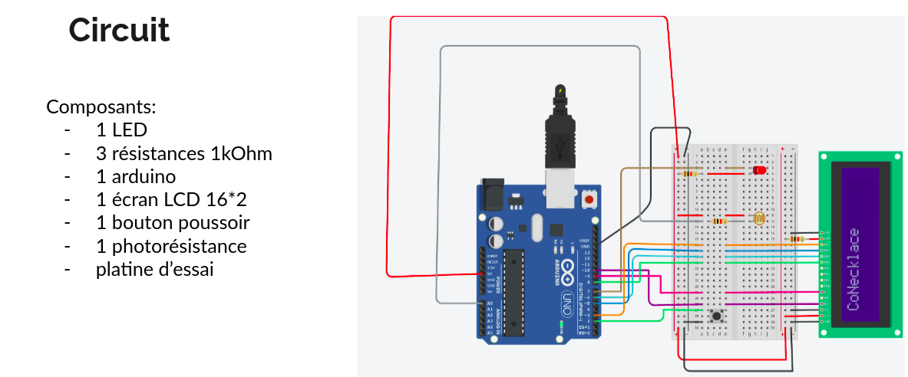

# CoNecklace
Medical assistance through a connected necklace

## Description

  

CoNecklace is a connected necklace for senior, especially for those who live alone.
It's able to alert the emergency in case of a heart attack, a stroke or even a ceasure.

## Team
<ul>
  <li>Kamel MALKI</li>
  <li>Hedi BOUFADEN</li>
  <li>Arnauld BIAM</li>
  <li>Ilès BENKOUSSA</li>
</ul>

## Features
<ul>
  <li>Emergency call 
    <ul>The necklace call/alert a service when there are heart attack symptoms. The employee reach out the client to make sure things are ok(just like an alarm security service) before deciding to call the emergency</ul>
  </li>
  <li>Global positioning system(GPS)
    <ul>Being able to locate a patient/client at any times day and night</ul>
  </li>
  <li>Alert and reminder tool
    <ul>Seniors might sometimes forget to take their medicine. CoNecklace includes that feature which remind them of a physician's appointment or just alert them on the right time on taking medication</ul>
  </li>
</ul>

## Composants list
| Composant | Role |
| --- | ---------------|
| GPS microchip | locate the patient at all times |
| heart rate sensor| locate the patient at all times |
| sleep tracking sensor | track the patient's sleep behaviour |
| alert and reminder tool | alert on taking medication period and even remind physician's appointment |
| RFID sensor | remote data recovery and backup |

## Links
[Circuit Tinkercad](https://www.tinkercad.com/things/csltpiHFjnu-amazing-snaget-vihelmo/editel?tenant=circuits)
[3D view](https://www.tinkercad.com/things/dATa1o6egGG-magnificent-sango-bigery/edit)
