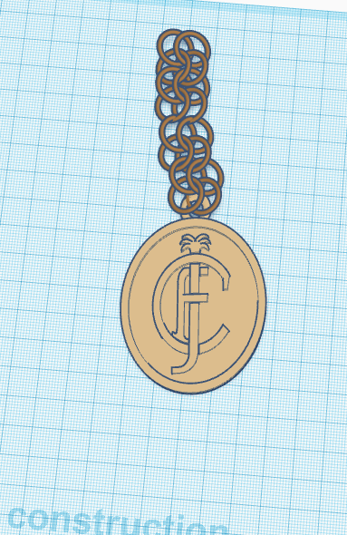

# CoNecklace
Medical assistance through a connected necklace

## Description

  

CoNecklace is a connected necklace for senior, especially for those who live alone.
It's able to alert the emergency in case of a heart attack, a stroke or even a ceasure.

## Team
<ul>
  <li>Kamel MALKI</li>
  <li>Hedi BOUFADEN</li>
  <li>Arnauld BIAM</li>
  <li>Ilès BENKOUSSA</li>
</ul>

## Features
<ul>
  <li>Emergency call 
    <ul>The necklace call/alert a service when there are heart attack symptoms. The employee reach out the client to make sure things are ok(just like an alarm security service) before deciding to call the emergency</ul>
  </li>
  <li>Global positioning system(GPS)
    <ul></ul>
  </li>
</ul>
